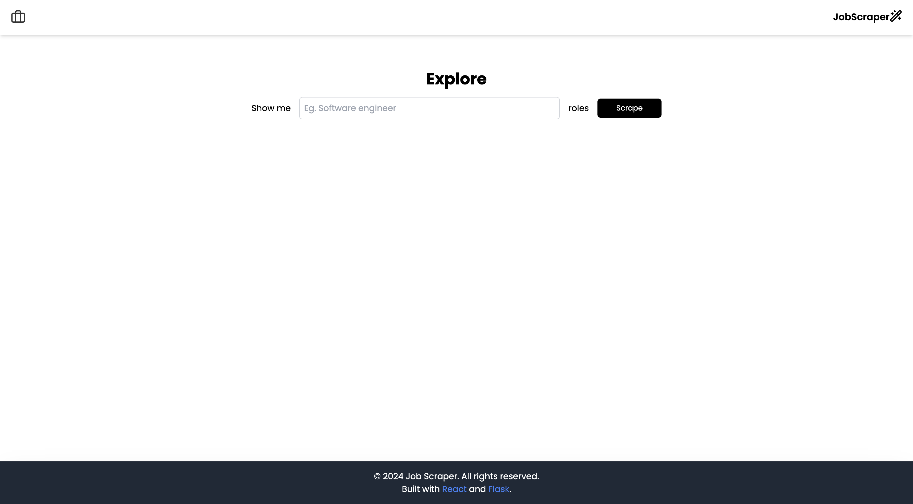

# Job Scraper

A full-stack application for scraping job listings based on user input. The frontend is built with React, and the backend is a Python Flask application. The project retrieves job data from a specified source and displays it on the frontend.

---

## 🚀 Demo Screenshot



---

## 🛠 Features

- Search for job listings by specifying a job title.
- Scrapes job-related data (title, company, location, etc.) from a predefined source.
- Displays data in a user-friendly interface.
- Loading and error-handling functionality.
- Backend proxy rotation for robust scraping.

---

## 🔧 Tech Stack

### Frontend

- React (with TypeScript)
- CSS for styling

### Backend

- Python
- Flask
- Beautiful Soup for web scraping
- Proxy rotation using `swiftshadow`

---

## Backend Installation Process

### Prerequisites

Before starting the installation, ensure you have the following:

- Python 3.6 or higher
- `pip` (Python package installer)
- Virtual environment (optional but recommended)
- Flask, Requests, BeautifulSoup4, Flask-CORS, and SwiftShadow packages

### Step 1: Clone the Repository

Clone the project repository to your local machine:

```bash
git clone the repository
cd backend

# For Windows
python -m venv venv
venv\Scripts\activate

# For Mac/Linux
python3 -m venv venv
source venv/bin/activate

pip install -r requirements.txt

pip install Flask requests beautifulsoup4 flask-cors swiftshadow

flask run

## 📝 Things I Learned

### Bypassing 403 Forbidden Request
- To bypass the "403 Forbidden" error, I used a proxy service.
- The proxy I used is free, but it comes with some limitations:
  - The first request is delayed due to a cache updating mechanism.
  - Cache updates occur every hour, which means you need to wait for the cache to refresh after initial usage.

### Fetching Locations and Job Names
- Initially, I tried fetching queries for both locations and job names. However, this approach triggered a CAPTCHA challenge.
- To avoid CAPTCHA issues, I updated the job name value dynamically. For example:
  - A job title like "Software Engineer" is converted to a slug format, i.e., `software-engineer`, before sending the request.

---

## 🐛 Known Issues
- **Slow Initial Request**: Due to proxy cache updates, the first request might take longer to process.
```
